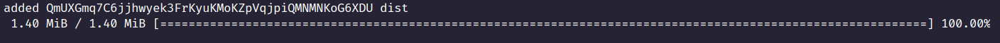
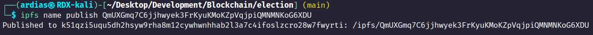
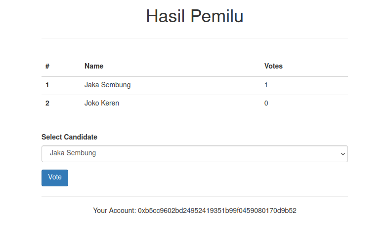
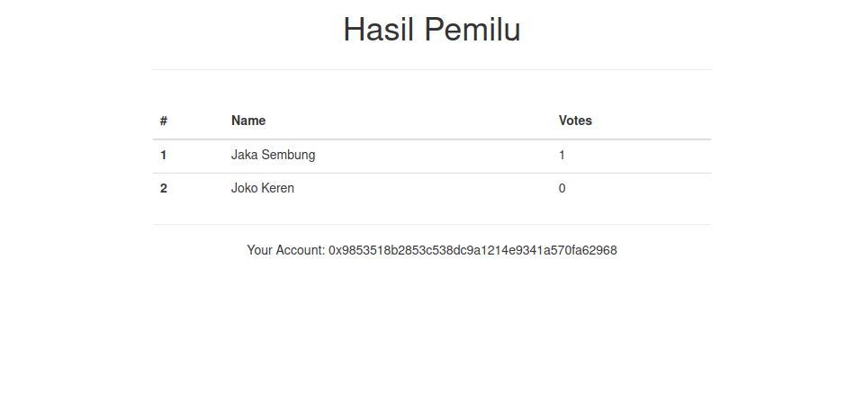

# Pemilu menggunakan Smart Contract beserta IPFS

## Description

Sebuah website pemilihan umum (pemilu) yang saya pelajari di tutorialnya [Dapp University](https://www.youtube.com/watch?v=3681ZYbDSSk&t=5801s) untuk mempelajari implementasi smart contract dan ipfs pada website yang telah dibuat.

## Technology Used

- Ethereum
- Solidity
- IPFS
- Metamask
- Ganache
- [Truffle Boxes Template - Pet Shop](https://trufflesuite.com/boxes/pet-shop/)

## Steps to start

1. Clone dan Install modules

```
$ git clone https://github.com/agilfchx/pemilu-blockchain.git pemilu
$ cd pemilu
$ npm install
```

2. Jalankan Ganache dan pastikan extension Metamask sudah terinstall
3. Pilih Network yang menuju ke Ganache dan import private key di Ganache ke Metamask
4. Jalankan web dan akses http://localhost:3000

```
npm run dev
```

5. Akan muncul pop up Metamask untuk masuk ke akun yang ada di Metamask
6. Lakukan vote terhadap kandidat yang ada (bisa diganti di `contracts/Election.sol` untuk kandidatnya di constructor)

### Menyimpan di IPFS

1. Jalankan

```
ipfs daemon
```

2. Tambah folder `dist/` ke ipfs

```
ipfs add -r dist/
```

3. Masukkan hash terakhir seperti di gambar yang menunjukkan folder tersebut
   
4. Publish hash tersebut

```
ipfs name publish [hash]
```

5. Akses IPFS menggunakan `ipfs://ipfs/[hash]` yang sudah diberikan (bisa pakai extension `IPFS Companion`)
   

- Note: katanya ada [gateway](https://docs.ipfs.tech/concepts/ipfs-gateway/#gateway-providers) dari IPFS tetapi masih belum jalan ketika akses gatewaynya `/ipfs/QmUXGmq7C6jjhwyek3FrKyuKMoKZpVqjpiQMNMNKoG6XDU`

## Tampilan

1.  Jika belum melakukan voting
    
2.  Sudah melakukan voting
    
